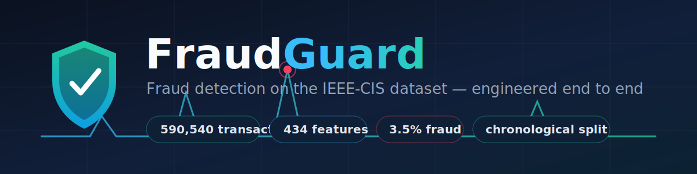

<p align="center">
  
</p>

# FraudGuard

A fraud-detection project built on the **IEEE-CIS Fraud Detection** dataset
(Kaggle competition `ieee-fraud-detection`) — the real one that requires
feature engineering across a transaction/identity join, not the toy
`creditcard.csv`.

The project is delivered in **6 phases**. This repository currently implements:

> ### Phase 1 — Data acquisition, merge & temporal split ✅
> Load the raw CSVs, left-join identity onto transactions, downcast dtypes to
> fit a laptop, persist to Parquet, and build a **strictly chronological**
> train/validation/test split with a pytest guardrail against leakage.
>
> No encoding, no feature engineering, no models yet — those are later phases.

---

## Project structure

```
fraudguard/
├── data/
│   ├── raw/            # raw Kaggle CSVs  (gitignored — large)
│   └── processed/      # merged parquet + split artifacts (gitignored)
├── notebooks/          # exploratory notebooks
├── reports/figures/    # saved EDA plots (gitignored, regenerated)
├── src/
│   ├── data_prep.py    # load → merge → downcast → parquet → temporal split
│   └── eda.py          # class imbalance, missingness, TransactionDT range
├── tests/
│   └── test_temporal_split.py   # asserts the split is leak-free
├── requirements.txt
└── README.md
```

`data/raw` and `data/processed` are **gitignored** — the dataset is hundreds of
MB and must never be committed. `.gitkeep` files preserve the empty folders.

---

## Data acquisition (manual step — required before anything runs)

The IEEE-CIS data is **not** redistributable, so it is not in this repo. Each
person must download it themselves from Kaggle:

1. **Create a free Kaggle account** at <https://www.kaggle.com>.
2. **Accept the competition rules.** Go to
   <https://www.kaggle.com/c/ieee-fraud-detection>, open the **Rules** tab, and
   click *"I Understand and Accept"*. The download **will fail with a 403 until
   you have accepted the rules for this specific competition** — an account
   alone is not enough.
3. **Create a Kaggle API token.** On your Kaggle account page
   (<https://www.kaggle.com/settings>) → *API* → **Create New Token**. This
   downloads `kaggle.json` (your username + key).
4. **Place the token where the CLI expects it:**
   - macOS / Linux: `~/.kaggle/kaggle.json` — then `chmod 600 ~/.kaggle/kaggle.json`
   - Windows: `C:\Users\<you>\.kaggle\kaggle.json`
5. **Install the CLI and download into `data/raw/`:**

   ```bash
   pip install kaggle
   kaggle competitions download -c ieee-fraud-detection -p data/raw
   cd data/raw && unzip ieee-fraud-detection.zip
   ```

   You need at least `train_transaction.csv` and `train_identity.csv` for
   Phase 1. (`kaggle.json` and everything under `data/raw/` are gitignored, so
   your credentials and the data will never be committed.)

   > **Why we don't use `test_transaction.csv` / `test_identity.csv`:** Kaggle's
   > official test set has **withheld labels** — it exists only for leaderboard
   > scoring, so no real metrics can be computed against it locally. All
   > evaluation in this project is reported on our own held-out **temporal test
   > split** carved from the labeled training data (the latest ~15%), which is
   > the correct choice, not a shortcut.

---

## Setup

```bash
python -m venv .venv
source .venv/bin/activate        # Windows: .venv\Scripts\activate
pip install -r requirements.txt
```

## Run Phase 1

```bash
# 1. Merge + downcast + temporal split  (writes to data/processed/)
python -m src.data_prep

# 2. EDA figures  (writes to reports/figures/)
python -m src.eda

# 3. Guardrail tests
pytest -q
```

### Outputs (in `data/processed/`)

| File | Contents |
|------|----------|
| `train_merged.parquet` | Transaction ⨝ identity, dtype-downcast |
| `split_indices.parquet` | `TransactionID`, `TransactionDT`, `split` (`train`/`val`/`test`) |
| `split_boundaries.json` | Auditable cut points + date-equivalent boundaries |

`src/data_prep.py` also **logs the split boundaries** at runtime so the split is
auditable without opening any file.

---

## Why these choices (design notes)

- **Left join, nulls kept.** Identity data covers only a subset of transactions.
  Those nulls are a real signal (identity present vs. absent), so rows are never
  dropped at the join.
- **Chronological split, never shuffled.** Fraud is a time-ordered problem;
  training on the future to predict the past leaks. The split cuts on
  `TransactionDT` **quantiles** (not row position) so a single timestamp can
  never straddle a boundary. `tests/test_temporal_split.py` asserts
  `max(train) < min(val) < ... < min(test)` and is designed to **fail loudly**
  if the logic is ever replaced with a random split.
- **Validation reserved for tuning + drift.** The middle 15% is for threshold
  tuning and the later drift simulation; the final 15% (test) stays untouched
  until final evaluation.
- **Dtype downcasting.** float64→float32 and int64→int32 (where the range fits,
  via `pd.to_numeric(downcast=...)`) roughly halves the memory footprint.

---

## Roadmap

1. **Phase 1 — Data acquisition, merge & temporal split** ✅ *(this repo)*
2. Phase 2 — Feature engineering & encoding
3. Phase 3 — Baseline modeling
4. Phase 4 — Model tuning & evaluation
5. Phase 5 — Drift simulation & monitoring
6. Phase 6 — Serving / deployment

> **TransactionDT note:** `TransactionDT` is a time delta in seconds from an
> undisclosed reference. The date-equivalent boundaries use the community
> reference `2017-12-01` purely for readability; nothing downstream depends on
> that anchor being exact.
```
